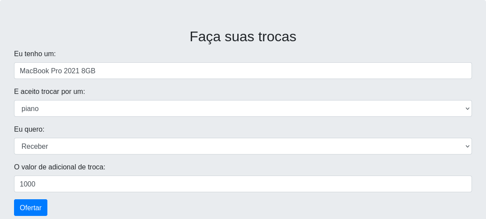

# PD_OLXellman

**Número da Lista**: 5 
**Conteúdo da Disciplina**: Programação Dinâmica 

## Alunos
|Matrícula | Aluno |
| -- | -- |
| 15/0129807  |  Ĩcaro Pereira de Oliveira |
| 14/0058371  |  Augusto Moreno Vilarins |

## Sobre 

Esse projeto é a evolução de outro trabalho feito pela dupla em [grafos2_OLXijkstra](https://github.com/projeto-de-algoritmos/grafos2_OLXijkstra/).

No trabalho anterior, utilizamos Djikstra. A limitação era que o usuário poderia apenas pedir um valor extra na troca. Agora, ele pode pagar um
valor extra na troca, uma vez que Bellman-Ford consegue lidar com valores negativos nas arestas.

Ou seja, ela pode dizer que tem uma camisa do Corinthians e quer trocar por um microfone HyperX Solocast, pagando um adicional de 200 dinheiros
por exemplo.

Cada item corresponde a um nó no array.

Cada troca/negociação coresponde a uma aresta do array, contendo
o item ofertado, o item desejado pela troca e o preço adicional de troca.

Fonte: [Grokking Algorithms](https://www.amazon.com/Grokking-Algorithms-J-Abelson/dp/020161622X)

## Screenshots

## Instalação 
**Linguagem**: Javascript 
**Framework**: ReactJS 

`npm install`

`npm start`

O projeto está em um servidor local, porta 3000.

## Uso 

O projeto ja inicia com um grafo de exemplo, inspirado no exemplo do livro.
Você pode adicionar mais trocas no formulario de trocas.
Você pode selecionar o item que você tem e o que você quer.